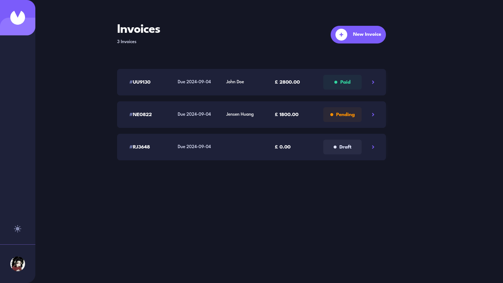

# Invoicify

### [Live Site](#)

## Table of contents

- [Overview](#overview)
- [Built With](#built-with)
- [Getting Started](#getting-started)
- [Contact](#contact)

## Overview

Invoicify is a robust invoicing application designed to help users create, manage, and track invoices seamlessly. It offers a user-friendly interface for generating invoices, tracking payment status, and maintaining client records.

## Built With

- [Next.js](https://nextjs.org/) - The React Framework for the Web
- [TypeScript](https://www.typescriptlang.org/) - Typed JavaScript
- [Zod](https://zod.dev/) - TypeScript-first schema declaration and validation library
- [Tailwind CSS](https://tailwindcss.com/) - Utility-first CSS framework
- [React Hook Form](https://react-hook-form.com/) - Performant, flexible, and extensible forms with easy-to-use validation
- [Framer Motion](https://www.framer.com/motion/) - An open-source motion library for React
- [NextAuth.js](https://next-auth.js.org/) - Authentication for Next.js

## Previews

### Home Page (No Invoices, User Not Signed In)

### Sign In Modal

### User Signed In

### Add Invoice Modal

### Invoice Input Error

### Invoice Items

### Draft Invoice

### Pending Invoice

### Paid Invoice

### Delete Invoice Modal

### Sign Out Modal
